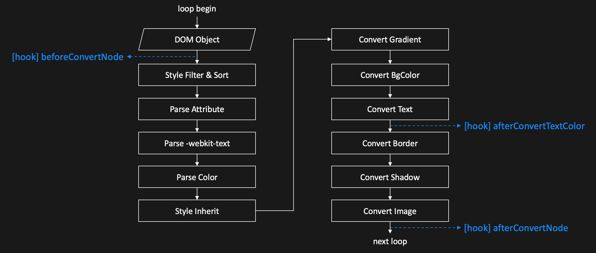

[English](../en/plugins.md) | 简体中文

插件
==============================

## 使用插件

```javascript
Darkmode.extend([pluginA, pluginB, pluginC]);
```

**注意：** `Darkmode.extend()` 必须在 `Darkmode.run()` 之前执行，否则插件不生效。

## 编写插件

### 概览

Darkmode 会通过 `extend` 方法传入插件基类 `Plugin`，开发者在编写自己的插件时，需要继承插件基类。通过插件基类，开发者可以访问一些插件内置属性和方法，并且可以使用插件钩子来编写自己的逻辑。

```javascript
export default function (Plugin) {
  return class extends Plugin {
    constructor() {
      super(); // 插件基类包含一些内置属性和方法

      ... // 可以在这里自定义插件属性
    }

    // BEGIN: 插件钩子
    beforeConvertNode(el) {}

    afterConvertNode(el) {}

    afterConvertTextColor(el, opt) {}
    // END: 插件钩子

    ... // 可以在这里自定义插件方法
  }
};
```

### 内置属性和方法

所有内置属性和方法都可以在插件里通过 `this` 访问。

#### 内置属性

- `loopTimes` &lt;number&gt; 已遍历次数（全部节点遍历结束算一次）。
- `isDarkmode` &lt;boolean&gt; 是否为Dark Mode。

#### 内置方法

##### `addCss(className, kvList, needMediaQuery)`

- `className` &lt;string&gt; DOM 节点类名。
- `kvList` &lt;Array&gt; css 键值对列表。
  - `kvList[0].key` &lt;string&gt; css 属性。
  - `kvList[0].value` &lt;string&gt; css 值。
- `needMediaQuery` &lt;boolean&gt; 是否需要添加 Dark Mode 媒体查询。

添加样式。

```javascript
this.addCss('test_class1', [{
  key: 'color',
  value: '#DDD'
}, {
  key: 'text-align',
  value: 'center'
}], true);

this.addCss('test_class2', [{
  key: 'cursor',
  value: 'pointer'
}], true);

// 运行结果
// @media (prefers-color-scheme: dark) {.test_class1{color: #DDD !important;text-align: center !important;}.test_class2{cursor: pointer !important;}}
```

### 插件钩子



#### `beforeConvertNode(el)`

- `el` &lt;DOM Object&gt; 当前转换的 DOM 节点。

节点开始转换前的钩子。

**注意：** 如果在这个钩子里对节点进行操作（如修改内联样式），将会影响后续的转换结果。如果不希望对转换结果造成影响，建议使用 [afterConvertNode()](#afterconvertnodeel) 钩子。

#### `afterConvertTextColor(el, opt)`

- `el` &lt;DOM Object&gt; 当前转换的 DOM 节点。
- `opt` &lt;Object&gt; 文本颜色对象。
  - `opt.fontColor` &lt;Color Object&gt; 文本前景色 `Color` 对象。
  - `opt.bgColor` &lt;Color Object&gt; 文本背景色 `Color` 对象。

文本样式转换结束后的钩子。

**注意：** `Color` 对象基于 [color](https://www.npmjs.com/package/color)，使用时注意保持版本一致（版本号详见 [package.json](../../package.json#L7)）。

#### `afterConvertNode(el)`

- `el` &lt;DOM Object&gt; 当前转换的 DOM 节点。

节点转换结束后的钩子。
